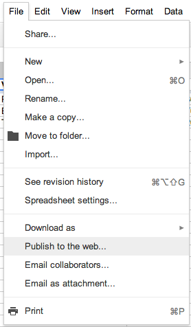
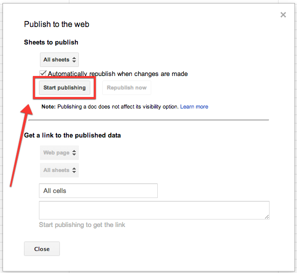

# GoogleDocsBackend

Use a Google Docs Spreadsheet in a style similar to Parse.  You can setup a spreadsheet with all of the data you want, and pull that into your mobile application.  An example spreadsheet can be seen [here](https://docs.google.com/spreadsheet/ccc?key=0Atoge9gLkMCTdENkUkVENElFczlmTDl1ODZWaTJmeFE&usp=sharing).

## Setup

To allow a Google Spreadsheet to be accessed via this library (and API calls), you must Publish it. *Note: Publishing and simply setting as public are two seperate things. See screenshots below*

In order to convert these into native NSObects, you need to subclass `GDBModel`, which makes use of [Mantle](https://github.com/MantleFramework/Mantle).  The important part is to implement `+ (NSDictionary *)JSONKeyPathsByPropertyKey` in order to map the column headers to native attributes.  See `GDBExampleShowModel` for a demonstration on how to do this.

Once you have that done, you can call `[GoogleDocsServiceLayer objectsForWorksheetKey: sheetId: modelClass: callback:]` in order to fetch the information from that spreadsheet and convert them into local native objects.  See `GDBExampleViewController`'s `viewDidLoad` for an example.  *Note: Google Docs appears to 1-index their spreadsheets instead of 0-index, so the first sheet in a worksheet would be index `1`*

## Shortcomings

A service like [Parse](https://parse.com/) is far more powerful, this is purely an attempt to have a cheap and free alternative.  Several things Parse can do that this can't at this time:

* Allow client-side creation of objects
* Support pointers/relationships

What it CAN do:

* Support unlimited number of collaborators via sharing the document via Google Drive/Docs to other Google users
* Be free for unlimited API requests

Right now this only works as a read-only, non-relational backend.  If that works for you, hurray!

## Usage

To run the example project; clone the repo, and run `pod install` from the Example directory first.

## Installation

GoogleDocsBackend is available through [CocoaPods](http://cocoapods.org), to install
it simply add the following line to your Podfile:

    pod "GoogleDocsBackend"

## TODOs

- [ ] Handle gaps in cells better
- [ ] Parse header keys via NSRegularExpressions
- [ ] Clean up documentation
- [ ] Enable writing of data
- [ ] Handle BOOLs and NSDates more cleanly
- [ ] Allow accessing of non-attributed values

## Author

pyro2927, joseph@pintozzi.com

## License

GoogleDocsBackend is available under the GPLv2 license. See the LICENSE file for more info.
